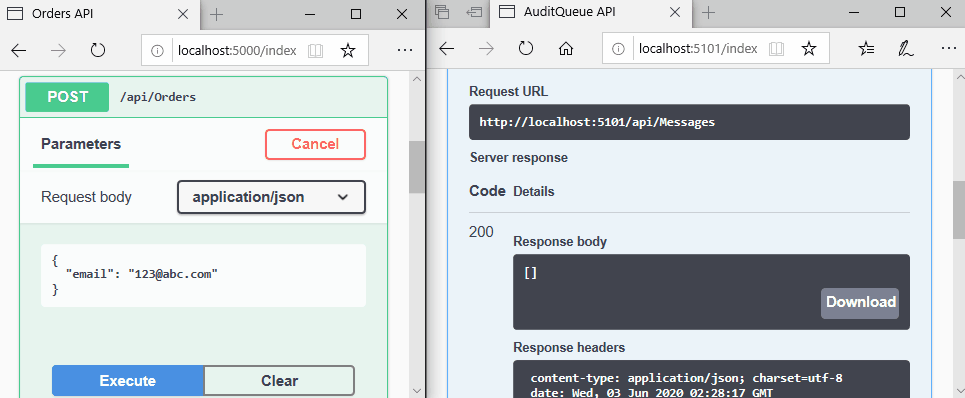

# RabbitMQ on Docker Starter: Audit Queue

```Docker
docker-compose build
docker-compose up

# Start RabbitMQ only
docker-compose run --service-ports rabbitmq

# Remove the MongoDB volume
docker volume rm 05_auditqueue_mongodata

```

## Demo

A basic pub/sub model with a message producer (a Web API app) and a consumer (a Worker Service app).
This demo also includes an audit queue, which persists messages to a MongoDB database.

```bash
# RabbitMQ management website logins
admin:admin123 (admin account)
ops0:ops0 (msg producer account)
ops1:ops1 (msg consumer account)
```



## Notes

1. MongoDB mount /data/db issues
   - [mongo issue #74](https://github.com/docker-library/mongo/issues/74)
   - [StackExchange question](https://dba.stackexchange.com/questions/186478/mongodb-refuse-to-start-operation-not-permitted)
